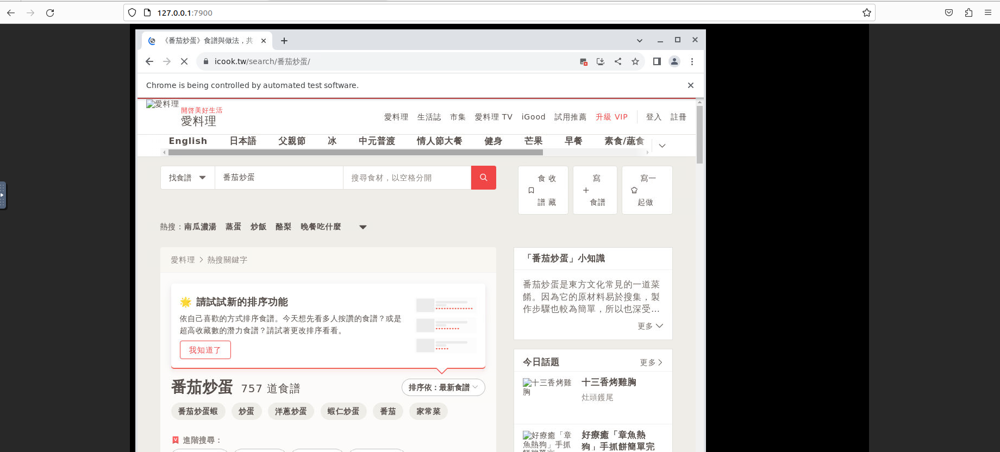

# Recipe-Quotation

## 料理食材換算與估價網


## 目的

隨著畢業季的到來，身邊的朋友將為了前程各奔東西，這可能是大家最後一次見面了
因此在離開學校前，MOLi 地縛靈希望能一起吃一頓飯，每個人自己準備一道料理。
但平時大家都只會準備一人份的量，突然要準備那麼多人的份量並計算所花費的價錢，可能都沒有經驗，所以我們想試試看能不能做出能讓人根據菜單及人數推估出來食材份量及總花費的網頁工具。

## Existing Library/Software

- 爬蟲：Selenium
- 架網站：Python Flask
- 部屬網站：Docker
- 資料庫：MySQL

## 測試環境

1. Ubuntu 22.04
2. Docker version 24.0.5, build ced0996
3. Docker Compose version v2.20.2

## 安裝說明

1. [在 Ubuntu 上安裝 Docker Engine](https://docs.docker.com/engine/install/ubuntu/#install-using-the-repository)

- Set up the Docker repository
  ```bash=
  sudo apt-get update
  sudo apt-get install ca-certificates curl gnupg
  sudo install -m 0755 -d /etc/apt/keyrings
  curl -fsSL https://download.docker.com/linux/ubuntu/gpg | sudo gpg --dearmor -o /etc/apt/keyrings/docker.gpg
  sudo chmod a+r /etc/apt/keyrings/docker.gpg
  echo \
    "deb [arch="$(dpkg --print-architecture)" signed-by=/etc/apt/keyrings/docker.gpg] https://download.docker.com/linux/ubuntu \
    "$(. /etc/os-release && echo "$VERSION_CODENAME")" stable" | \
    sudo tee /etc/apt/sources.list.d/docker.list > /dev/null
  sudo apt-get update
  ```
- Install Docker Engine
  ```bash=
  sudo apt-get install docker-ce docker-ce-cli containerd.io docker-buildx-plugin docker-compose-plugin
  ```
- Verify that the Docker Engine installation is successful by running the hello-world image.
  ```bash=
  sudo docker run hello-world
  ```

2. [安裝 Docker Compose CLI](https://docs.docker.com/compose/install/linux/)

```bash=
sudo apt-get update
sudo apt-get install docker-compose-plugin
```

- 查看 Docker Compose 的版本，確認是否安裝成功
  ```bash=
  docker compose version
  ```

3. 下載此 GitHub 專案

```bash=
git clone https://github.com/Huei-Lin-Lin/Recipe-Quotation.git
```

4. 啟動服務

```bash=
docker compose build
docker compose up
```

5. 可查看以下網頁畫面

- selenium chrome session
  - `http://{your IP}:4444`
    
- 料理食材換算與估價網的主畫面
  - `http://{your IP}:5000`
    
  - 輸入料理資料
    
  - 顯示爬蟲中
    
- 顯示爬蟲時的網頁畫面
  - `http://{your IP}:7900`
    
  - 密碼：`secret`
    
  - 爬蟲畫面
    
- 搜尋結果範例
  

6. 結束服務

```bash=
docker compose down
```

## 參考資料

- Selenium
  - [Selenium with Python](https://selenium-python.readthedocs.io/)
- Flask
  - [Flask Web App Tutorial](https://youtu.be/dam0GPOAvVI)
- Docker
  - [Compose file build reference](https://docs.docker.com/compose/compose-file/build/)
  - [docker 基本指令](https://hackmd.io/@ncnu-opensource/book/https%3A%2F%2Fhackmd.io%2F%40108213034%2FB1_qNP2xc#DEMO)
  - [Run Selenium Tests in Docker](https://www.browserstack.com/guide/run-selenium-tests-in-docker)
  - [docker-selenium](https://github.com/SeleniumHQ/docker-selenium)
- 網頁
  - [How To Make A Search Bar Using HTML And CSS In 10 Just Minutes](https://youtu.be/9hnJsNIBq1g)
  - [pushing pixels css loader](https://codepen.io/redlabor/full/nzwPGv)
